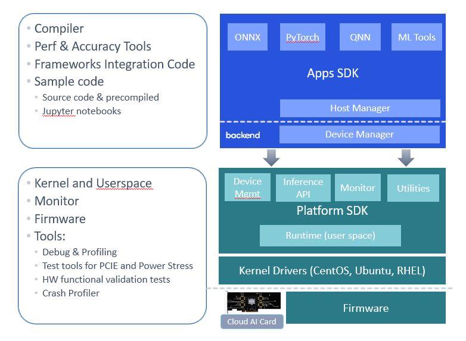

# Getting Started with Cloud AI 

Cloud AI SDKs enable developers to optimize trained deep learning models for high-performance inference. The SDKs provide workflows to optimize the models for best performance,  provides runtime for execution and supports integration with ONNXRT and Triton Inference Server for deployment.

Cloud AI SDKs support 
- Generative AI, Natural Language Processing, and Computer Vision models running on Cloud AI hardware performantly
- Optimize performance of the models per application requirements (throughput, accuracy and latency) through various quantization techniques
- Development of inference applications through support for multiple OS and docker containers.  
- Deploy inference applications at scale with support for Triton (**trademark**) inference server

## Cloud AI SDKs
An Application and Platform SDK constitute the Cloud AI SDK. 

The Application (Apps) SDK consists of model development tools, including a sophisticated parallelizing compiler, performance and integration tools, and code samples. Apps SDK is supported on  

The Platform SDK consists of development tools icluding a kernel space runtime, which contains the API's and language bindings, accompanied by kernel drivers, a user space runtime, card firmware, and several card monitoring, telemetry, profiling and debugging tools.  

 

 

