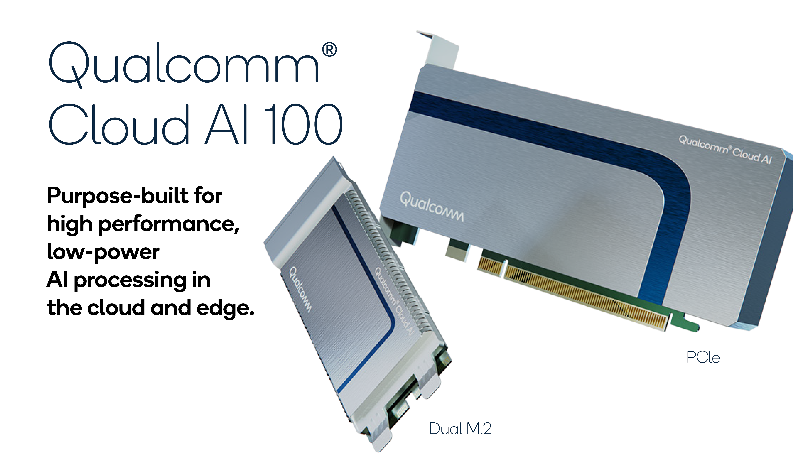

  <picture>
    
  </picture>

| <a href="https://quic.github.io/cloud-ai-sdk-pages/latest/"><b>User Guide</b></a> | <a href="https://quic.github.io/cloud-ai-sdk-pages/latest/Getting-Started/Installation/"><b>Download SDK</b></a> | <a href="https://quic.github.io/cloud-ai-sdk-pages/latest/blogs/Train_Anywhere/train_anywhere/"><b>Blog</b></a> |

---

# Qualcomm Cloud AI SDK - Developer Resources

---

*Latest News* 🔥
- [2025/07] The [Open WebUI tutorial](https://github.com/quic/cloud-ai-sdk/tree/1.19/tutorials/open-webui) shows how to use Open WebUI's chat interface with Cloud AI accelerators. 
- [2024/11] Check out the [Qualcomm Cloud AI Playground Tutorial](https://github.com/quic/cloud-ai-sdk/tree/1.19/tutorials/Playground) to learn how to access the latest Generative AI models running on Qualcomm Cloud AI 100 Ultra Accelerators hosted in the cloud.
- [2024/11] Added support for [Stable Diffusion XL Turbo](https://github.com/quic/cloud-ai-sdk/tree/1.19/models/multimodal/text_to_image/sdxl_turbo)
- [2024/11] Added support for [Stable Diffusion 3](https://github.com/quic/cloud-ai-sdk/tree/1.19/models/multimodal/text_to_image/stable-diffusion-3-medium-diffusers)
- [2024/09] Added support for [Whisper](https://github.com/quic/cloud-ai-sdk/tree/1.19/models/speech/whisper)
- [2024/09] Added support for [SDXL-DeepCache](https://github.com/quic/cloud-ai-sdk/tree/1.19/models/multimodal/text_to_image/sdxl_deepcache)
- [2024/04] Qualcomm released [efficient transformers](https://github.com/quic/efficient-transformers) for seamless deployment of pre-trained LLMs.
- [2024/03] Added [AI 100 Ultra recipe for Llama family of LLMs](https://github.com/quic/cloud-ai-sdk/tree/1.19/models/language_processing/decoder/LlamaForCausalLM) - e.g., [Llama-2-7B](https://huggingface.co/meta-llama/Llama-2-7b)
- [2024/03] Added support for Speculative Decoding with LLMs - [CodeGen with Speculative Decoding](https://github.com/quic/cloud-ai-sdk/tree/1.19/models/language_processing/decoder/CodeGen-With-Speculative-Decoding)
- [2024/02] Added support for [Stable Diffusion XL](https://github.com/quic/cloud-ai-sdk/tree/1.19/models/multimodal/text_to_image/sdxl_turbo)
- [2024/02] Added support for [MPT family of LLMs](https://github.com/quic/cloud-ai-sdk/tree/1.19/models/language_processing/decoder/MptForCausalLM) - e.g., [MPT-7B](https://huggingface.co/mosaicml/mpt-7b)
- [2024/02] Added support for [GPTBigCode family of LLMs](https://github.com/quic/cloud-ai-sdk/tree/1.19/models/language_processing/decoder/GPTBigCodeForCausalLM) - e.g., [StarCoder](https://huggingface.co/bigcode/starcoder)
- [2024/01] Added [profiling tutorial for LLMs](https://github.com/quic/cloud-ai-sdk/blob/1.19/tutorials/NLP/Profiler-Intermediate/Profiler-LLM.ipynb)
- [2024/01] Added support for [DeciDiffusion-v2.0](https://github.com/quic/cloud-ai-sdk/tree/1.19/models/multimodal/text_to_image/DeciDiffusion-v2-0)
- [2024/01] Added support for [DeciCoder-6B](https://github.com/quic/cloud-ai-sdk/tree/1.19/models/language_processing/decoder/DeciCoder-6b)
- [2024/01] Added support for [Llama family of LLMs](https://github.com/quic/cloud-ai-sdk/tree/1.19/models/language_processing/decoder/LlamaForCausalLM) - e.g., [Llama-2-7B](https://huggingface.co/meta-llama/Llama-2-7b)
---

## About
Qualcomm Cloud AI 100 offers a unique blend of high computational performance, low latency, and low power utilization, making it well-suited for a broad range of AI applications, including computer vision, natural language processing, and Generative AI such as Large Language Models (LLMs). Specifically designed for high-performance, low-power AI processing, it is ideal for both public and private cloud environments, supporting Enterprise AI applications.

This repository provides developers with 3 key resources
- Models    - Recipes for [CV](https://github.com/quic/cloud-ai-sdk/tree/1.19/models/vision), [NLP](https://github.com/quic/cloud-ai-sdk/tree/1.19/models/language_processing), [multimodal](https://github.com/quic/cloud-ai-sdk/tree/1.19/models/multimodal/text_to_image) models to run on Cloud AI platforms performantly,   For LLM, embeddings and speech models, see [efficient-transformers](https://github.com/quic/efficient-transformers)
- Tutorials - [Tutorials](https://github.com/quic/cloud-ai-sdk/tree/1.19/tutorials) cover model onboarding, performance tuning, and profiling aspects of inferencing across CV/NLP on Cloud AI platforms
- Samples   - Sample code illustrating usage of APIs - [Python](https://github.com/quic/cloud-ai-sdk/tree/1.19/samples/python) and [C++](https://github.com/quic/cloud-ai-sdk/tree/1.19/samples/cpp/cpp_qpc_inference) for inference on Cloud AI platforms

## 📚 Supported Models
### Generative AI - Large Language Models (LLMs), Embeddings and Speech
- See [efficient-transformers](https://github.com/quic/efficient-transformers)

### 💬 [Generative AI - Text-to-Image Models](https://github.com/quic/cloud-ai-sdk/tree/1.19/models/multimodal/text_to_image)
- Stable Diffusion (`stabilityai/stable-diffusion-xl-base-1.0`, `stabilityai/stable-diffusion-2-1`, `runwayml/stable-diffusion-v1-5`, etc.)
- DeciDiffusion (`Deci/DeciDiffusion-v2-0`, `Deci/DeciDiffusion-v1-0`, etc.)

### 🤖 [NLP - Encoder-only Transformer Models](https://github.com/quic/cloud-ai-sdk/tree/1.19/models/language_processing/encoder)
- 80+ models including all varieties of `bert` models, `sentence-transformer` embedding models, etc.

### 👀 [Computer Vision (CV) Models](https://github.com/quic/cloud-ai-sdk/tree/1.19/models/vision)
- ViT (`vit_b_16`, `vit_b_32`, `vit-base-patch16-224`)
- YOLO (`yolov5s`, `yolov5m`, `yolov5l`, `yolov5x`, `yolov7-e6e`, `yolov8`)
- ResNet (`resnet18`, `resnet34`, `resnet50`, `resnet101`, `resnet152`)
- ResNeXt (`resnext101_32x8d`, `resnext101_64x4d`, `resnext50_32x4d`)
- Wide ResNet (`wide_resnet101_2`, `wide_resnet50_2`)
- DenseNet (`densenet121`, `densenet161`, `densenet169`, `densenet201`)
- MNASNet (`mnasnet0_5`, `mnasnet0_75`, `mnasnet1_0`, `mnasnet1_3`)
- MobileNet (`mobilenet_v2`, `mobilenet_v3_large`, `mobilenet_v3_small`)
- EfficientNet (`efficientnet_v2_l`, `efficientnet_v2_m`, `efficientnet_v2_s`, `efficientnet_b0`, `efficientnet_b7`, etc.)
- ShuffleNet (`shufflenet_v2_x0_5`, `shufflenet_v2_x1_0`, `shufflenet_v2_x1_5`, `shufflenet_v2_x2_0`)
- SqueezeNet (`squeezenet1_0`, `squeezenet1_1`)

# Support 
Reach out on the [📢cloud-ai Discord channel](https://discord.com/invite/qualcommdevelopernetwork) or use [💬 GitHub Issues](https://github.com/quic/cloud-ai-sdk/issues) to request for model support, raise questions or to provide feedback.

# Disclaimer
While this repository may provide documentation on how to run models on Qualcomm Cloud AI platforms, this repository does NOT contain any of these models.  All models referenced in this documentation are independently provided by third parties at unaffiliated websites. Please be sure to review any third-party license terms at these websites; no license to any model is provided in this repository. This repository of documentation provides no warranty or assurances for any model so please also be sure to review all model cards, model descriptions, model limitations / intended uses, training data, biases, risks, and any other warnings given by the third party  model providers.

## License
The documentation made available in this repository is licensed under the BSD 3-clause-Clear “New” or “Revised” License. Check out the [LICENSE](LICENSE) for more details.
