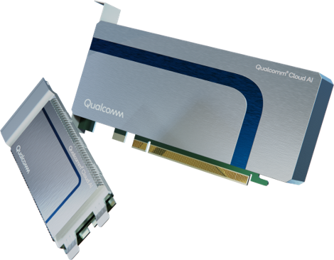
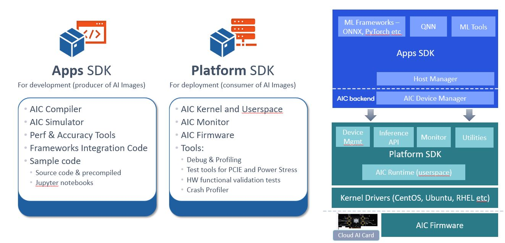

# Qualcomm cloud-ai
Staging area for examples on external github
=======
## QAIC100  
  

Qualcomm Cloud AI inference accelerator cards and accompanying SDKs offer superior power and performance capabilities to meet the growing inference needs of Cloud Data Centers, Edge, and other machine learning (ML) applications. The Apps and Platform SDKs provide the ability to compile, optimize, and run deep learning models from popular frameworks such as PyTorch, TensorFlow, ONNX, Caffe, and Caffe2.

  

This repository contains sample applications, model recipes, tutorials, etc to aid beginner/intermediate/advanced developers.     
# Platform SDK Installation 

# APPS SDK Installation 

# Directory structure
```
.
├── API_Reference_Card      # Provides quick overview of APIs to interact with QAIC100
├── docker                  # dockerfiles
|── images                  # Images related to documentation 
|── model_configs           # Config and script files for some popular models (#FIXME Rohan please add your files here)
|── samples                 # End-to-end inference examples on QAIC100
│   ├── cpp                 # CPP based APIs used for QAIC100 inference
│   ├── python              # Python based APIs used for QAIC100 inference (#FIXME Amey add details about subdirectories)
└── triton                  # example using triton framework
└── tutorials               # Jupyter notebook based tutorials.
  - Gettting Started
    - README.md
    - NLP
      - bert-base
        - tutorial1
            -nb1.ipynb
            -nb1.ipynb
    - CV

```

# Table of contents  
1. [Introduction](#introduction)  
2. [System support and SDK installation](#sdk)  
3. [Quick Start](#quick-start)  
4. [Prebuilt Samples](#prebuilt-samples)
5. [FAQ](#faq)
5. [License](#license)
6. [Resources](#resources)

Note: This repository is a public mirror, pull requests will not be accepted. Please file an issue if you have a feature or bug request.

Add points: #FIXME
1. SDK version
2. Card health, resources, and logs
