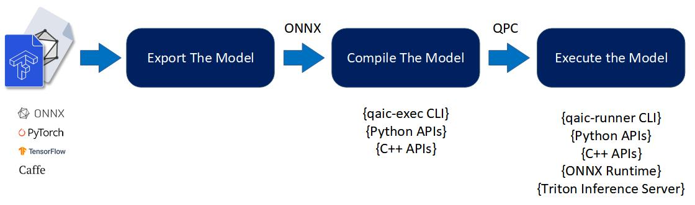

# Getting Started with Cloud AI SDK

Cloud AI SDKs enable developers to optimize trained deep learning models for high-performance inference. The SDKs provide workflows to optimize the models for best performance,  provides runtime for execution and supports integration with ONNXRT and Triton Inference Server for deployment.

Cloud AI SDKs support 
- Generative AI, Natural Language Processing, Recommender systems and Computer Vision models running on Cloud AI hardware performantly
- Optimize performance of the models per application requirements (throughput, accuracy and latency) through various quantization techniques
- Development of inference applications through support for multiple OS and docker containers.  
- Deploy inference applications at scale with support for Triton (**trademark**) inference server

There are 3 basic steps to execute a model on Cloud AI hardware:

