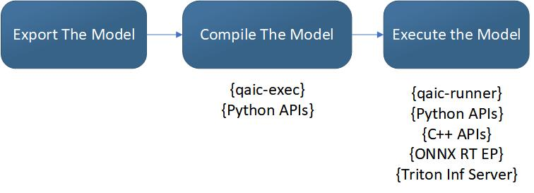

# Introduction 

Cloud AI SDKs enable developers to optimize trained deep learning models (Generative AI, NLP, CV etc) for high-performance inference. The SDKs provide workflows to optimize the models for best performance (accuracy, throughput and latency),  provides runtime for execution and supports integration with ONNXRT and Triton Inference Server for deployment.

There are 3 basic steps to execute your model on Cloud AI hardware:

