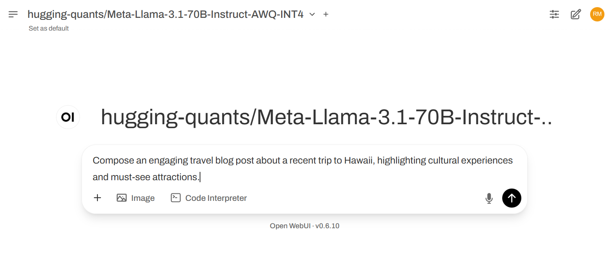
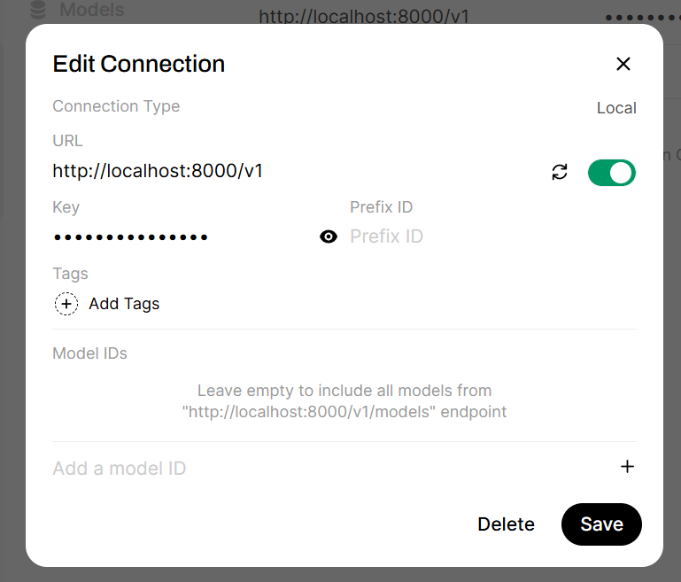

# Connecting Cloud AI models to Open WebUI

[Open WebUI](https://github.com/open-webui/open-webui) is a self-hosted web interface for AI use-cases like Chat, Image Generation and RAG.
We can connect Open WebUI to AI models served by Cloud AI accelerators by running OpenAI-compatible endpoints with vLLM.



## Pre-requisites

* Cloud AI Platform and Apps SDKs [Installation](https://quic.github.io/cloud-ai-sdk-pages/latest/Getting-Started/Installation/Cloud-AI-SDK/Cloud-AI-SDK/index.html)
* Cloud AI 100 Ultra accelerator card
* Python 3.10
* Docker

Preface all docker commands with `sudo`, or add yourself to the docker group:
```
sudo usermod -aG docker $USER
```

Launch a new shell or `newgrp docker` to apply the changes.

## Prepare the model

Use [Efficient Transformers](https://github.com/quic/efficient-transformers) to prepare popular models like Llama-3.3-70B-Instruct, Qwen2.5-Coder and Phi4, or download pre-generated model binaries at http://qualcom-qpc-models.s3-website-us-east-1.amazonaws.com/QPC/.  Note the location of the 'programqpc.bin' files as you'll need these to start vLLM. Efficient-transformers stores model binaries in [~/.cache/qeff_cache](https://quic.github.io/efficient-transformers/source/quick_start.html#transformed-models-and-qpc-storage) by default.

## Cloud AI Inference Container

[Cloud AI Inference containers](https://github.com/quic/cloud-ai-containers/pkgs/container/cloud_ai_inference_ubuntu22) include everything needed to compile and serve models with vLLM on Cloud AI accelerators.

Download the Docker image:

```
docker pull ghcr.io/quic/cloud_ai_inference_ubuntu22:1.19.8.0
```

## Start vLLM endpoint

Prepare a script to launch vLLM with the pre-generated model binary inside the container.

Customize the Hugging face model name (`--model`), context length (`--max-model-len`), prompt length (`max-seq_len-to-capture`) and full batch size (`max-num-seq`) to match the QPC from the 'Prepare the Model' step above.  You'll use the QPC binary path (programqpc.bin) in the `docker run` command below.

```
$ cat <<EOF > serve.sh
#!/bin/bash
/opt/vllm-env/bin/python3 -m vllm.entrypoints.openai.api_server --host 0.0.0.0 --port 8000 --model hugging-quants/Meta-Llama-3.1-70B-Instruct-AWQ-INT4 --max-model-len 4096 --max-num-seq 1 --max-seq_len-to-capture 128 --device qaic --device-group 0,1,2,3
EOF

$ chmod +x serve.sh
```

Note: Change `/path/to/qpc` to the QPC location from the 'Prepare the model' step above.
If your system has multiple Ultra cards, you can change the `--device` arguments to map a different card.
This example creates a `qaic-vllm` Docker volume to hold persistent data (namely the tokenizer weights downloaded from Hugging face).

```
docker run -dit \
  --workdir /model \
  --name qaic-vllm \
  --network host \
  --mount type=bind,source=${PWD}/serve.sh,target=/model/serve.sh \
  --mount type=bind,source=/path/to/qpc,target=/model/qpc \
  -v qaic-vllm:/model/data \
  --env VLLM_QAIC_MAX_CPU_THREADS=8 \
  --env VLLM_QAIC_QPC_PATH=/model/qpc \
  --env HF_HOME=/model/data/huggingface \
  --device=/dev/accel/accel0 \
  --device=/dev/accel/accel1 \
  --device=/dev/accel/accel2 \
  --device=/dev/accel/accel3 \
  --entrypoint=/model/serve.sh \
  ghcr.io/quic/cloud_ai_inference_ubuntu22:1.19.8.0
```

## Start Open WebUI

Download Open WebUI Docker image:

```
docker pull ghcr.io/open-webui/open-webui:main
```

Refer to [setup instructions](https://docs.openwebui.com/getting-started/quick-start/#quick-start-with-docker-) for more details.

Run the Open WebUI container:

```
docker run \
  -d \
  --network host \
  -e OPENAI_API_KEY=test-key \
  -e OPENAI_API_BASE_URL="http://localhost:8000/v1" \
  -v open-webui:/app/backend/data \
  --name open-webui \
  --restart always ghcr.io/open-webui/open-webui:main
```

In web browser, open http://<your_ip_or_server_name>:8080

Setup:
* For first time startup, create a default user.  This user will have admin access.
* Click Profile icon in upper right and open Admin Panel -> Settings -> Connections.
* Click Configure icon for Manage OpenAI API Connections.
* Make sure URL is http://localhost:8000/v1.  Key can be any value
* Click Verify Connection icon to test the connection.
* You should see a "Server Connection Verified" pop-up
* If it fails, double-check that the server.py script is running
* Back on the Open WebUI home page, select the model name from the 'Prepare the model' step above. 



You can now use the Chat interface in Open WebUI.